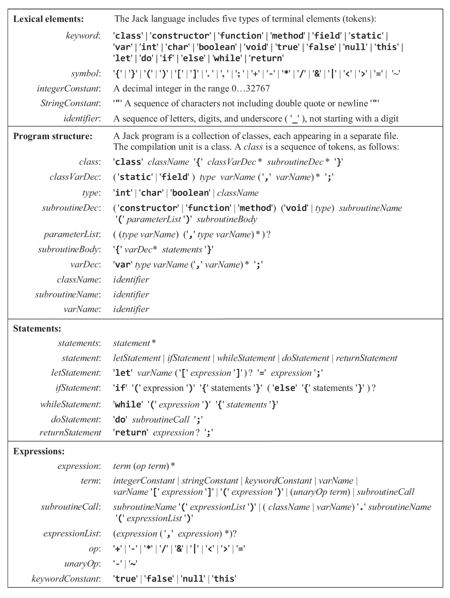
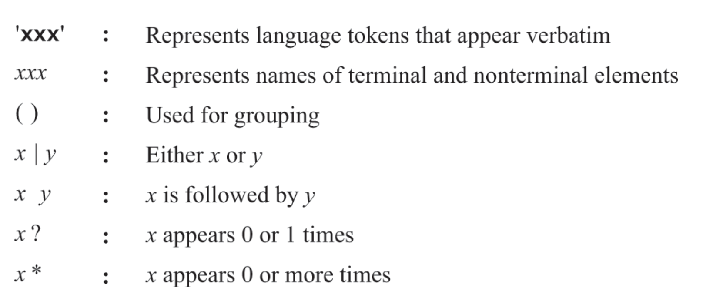

# Project 10 & 11

## Installation

```shell
pnpm i
```

## Usage

### Compiler

```shell
pnpm compile ./path/to/program
```

### Tokenizer Test

```shell
pnpm test:tokenizer ./tests/10/(ArrayTest | ExpressionLessSquare | Square)
```

### Parser Test

```shell
pnpm test:parser ./tests/10/(ArrayTest | ExpressionLessSquare | Square)
```

### Compiler Test

```shell
pnpm compile ./tests/11/(Seven | ConvertToBin | Square | Average | Pong | ComplexArrays)
```

## Jack Grammar



